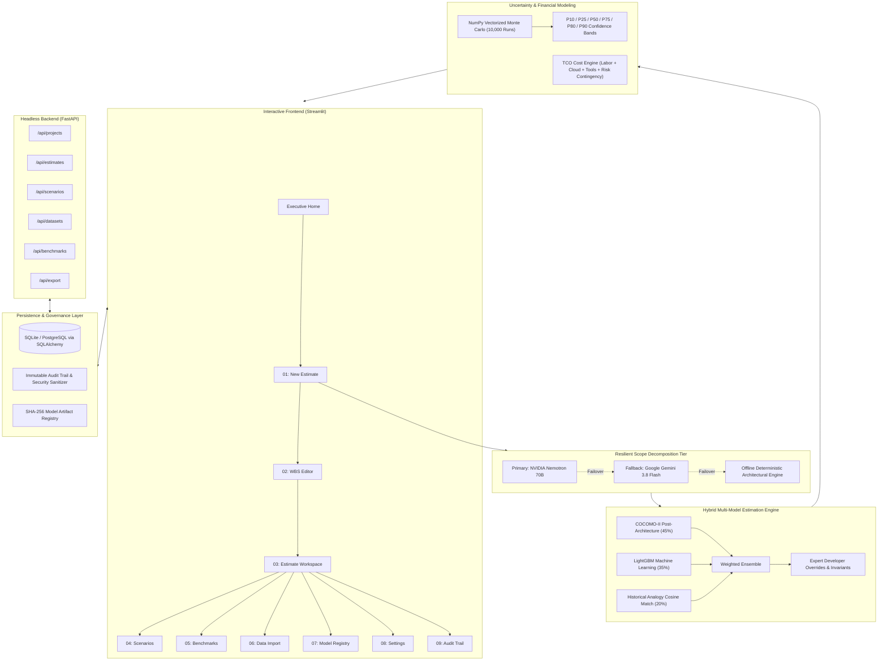

# ⚡ Costimator: AI-Powered Software Cost Estimation Platform

[](https://www.python.org/)
[](https://fastapi.tiangolo.com/)
[](https://streamlit.io/)
[](https://lightgbm.readthedocs.io/)
[](#-hybrid-estimation-ensemble)
[-purple.svg)](#-vectorized-monte-carlo-uncertainty-quantification)
[-success.svg)](#-testing--quality-assurance)
[](#-about-kle-hackfest-2026)

> **Production-grade AI scope decomposition, empirical hybrid estimation, and vectorized Monte Carlo uncertainty quantification for modern software engineering projects.**

---

## 📌 Executive Summary & Problem Statement

Software cost estimation has historically been plagued by two extremes:
1. **Unscientific Guesswork & Gut Feeling**: Teams rely on ad-hoc sprint velocity or optimistic developer estimates, leading to widespread budget overruns (an average of 45% over budget across industry projects according to McKinsey & Standish Group studies).
2. **Brittle Rigid Formulas**: Pure classic models like original waterfall COCOMO struggle to decompose modern microservices, cloud-native deployments, and complex third-party SaaS integrations.

**Costimator** bridges this divide. It delivers a **hybrid, mathematically grounded, and AI-accelerated estimation platform** designed for engineering leaders, project architects, and CFOs. It decomposes unstructured project requirements into a granular **Work Breakdown Structure (WBS)**, cross-validates effort through a **3-way ensemble** (COCOMO-II, historical PROMISE benchmarks, and trained LightGBM ML models), and quantifies real-world financial risk via **10,000-iteration vectorized Monte Carlo simulations**.

---

## 🏗️ System Architecture



---

## 🌟 Core Features & Technical Highlights

### 1. 🤖 Intelligent Scope Decomposition (Multi-Provider + Offline Resilience)
- **Natural Language to Structured WBS**: Takes high-level project goals (e.g., target platform, expected user volume, cloud constraints, compliance needs) and structures them into functional phases, modules, technical tasks, complexity scores, and deliverables.
- **Failover Chain**:
  1. **Primary**: NVIDIA Nemotron (`nvidia/llama-3.1-nemotron-70b-instruct`) for high-fidelity technical decomposition.
  2. **Secondary Fallback**: Google Gemini (`gemini-3.8-flash`) via the modern `google-genai` SDK.
  3. **Zero-Network Offline Engine**: A deterministic rule-based architectural engine (`offline_decomposer.py`) ensuring the app works **100% offline with zero API keys or network connection**.

### 2. ⚖️ Hybrid Multi-Model Estimation Ensemble
Costimator does not rely on a single black box. Effort and schedule are derived from a mathematically transparent ensemble:
- **COCOMO-II Post-Architecture Model (45% weight)**: Utilizes published empirical coefficients ($A = 2.94$, scale factors, and 17 cost drivers including reliability, database complexity, platform volatility, and personnel capability).
- **LightGBM ML Pipeline (35% weight)**: Gradient-boosted regressor trained on canonical software engineering datasets (NASA93, China, PROMISE) with automated feature encoding and clipping invariants.
- **Historical Analogy via Cosine Similarity (20% weight)**: Vectorized nearest-neighbor matching against historical projects based on normalized size (KSLOC), task count, and complexity distribution.
- **Expert Adjustments**: Architects can override specific task estimates with instant automatic recalibration and full audit attribution.

### 3. 🎲 Vectorized Monte Carlo Uncertainty Simulation
Single-point estimates are a recipe for failure. Costimator simulates **10,000 stochastic project lifecycles** in milliseconds using vectorized NumPy arrays:
- **Triangular Task Variance**: Each task is modeled with Optimistic ($a$), Likely ($m$), and Pessimistic ($b$) bounds.
- **Developer Velocity Drift**: Normal distribution ($\mu=1.0, \sigma=0.08$) capturing skill and productivity fluctuations.
- **Cloud Infrastructure Spikes**: Log-Normal distribution ($\mu=0.0, \sigma=0.12$) modeling compute and storage volatility.
- **Scope Creep Factor**: Bernoulli trials ($p=0.15$) introducing 5–20% mid-flight scope expansion.
- **Audited Risk Percentiles**: Computes P10, P25, P50 (median), P75, **P80 (recommended budget baseline)**, and P90 with mathematical invariant verification ($P80 \ge P50$).

### 4. 💰 Total Cost of Ownership (TCO) Breakdown
Provides an itemized financial cost engine:
- **Personnel & Engineering Labor**: Tiered hourly rates across engineering roles (Senior, Mid, Junior, QA, DevOps, Project Manager, Tech Lead, UI/UX).
- **Cloud Infrastructure**: Scaled monthly AWS/GCP/Azure compute, managed databases, object storage, networking, egress, and AI token allowances.
- **Developer Tooling & SaaS**: Licenses for IDEs, CI/CD runners, GitHub Enterprise, Datadog/monitoring, and automated security scanners.
- **Risk-Adjusted Contingency**: Configurable 10–30% contingency buffer based on organizational risk tolerance.

### 5. 🎛️ Interactive What-If Scenario Modeling
- Simulate real-world project pivots before spending a dollar:
  - **Fast-Track Launch**: Compress schedule by 20% and add senior engineering firepower.
  - **Budget-Constrained / Lean MVP**: Descope non-critical tasks and reduce infrastructure footprint.
  - **High-Assurance / Security-Hardened**: Elevate reliability cost drivers, audit logging, and QA testing cycles.
- View real-time side-by-side delta comparisons across cost, effort hours, calendar weeks, and team sizing.

### 6. 🔒 Enterprise Security & Compliance
- **Prompt Injection Defense**: All user inputs are sanitized and stripped of prompt evasion sequences (`input_sanitizer.py`).
- **CSV/Excel Formula Injection Defense**: Prevents spreadsheet exploitation by escaping dangerous execution tokens (`=`, `+`, `-`, `@`).
- **Model Provenance**: SHA-256 fingerprinting on all serialized ML models and datasets.
- **Immutable Audit Trail**: Chronological event logs capturing project creation, WBS modifications, expert overrides, scenario runs, and report exports.
- **JWT & Role-Based Auth**: Secure token-based access with bcrypt password hashing.

### 7. 📄 Multi-Format Export Engine
- **Executive PDF Report**: Publication-grade PDF generated with ReportLab, featuring executive summary, WBS breakdowns, cost distribution tables, and uncertainty charts.
- **Excel Spreadsheet (`.xlsx`)**: Formatted multi-tab workbook generated via openpyxl.
- **Sanitized CSV**: Ready for ingestion into PowerBI, Tableau, or Jira.
- **Machine-Readable JSON**: Standardized REST schema for CI/CD or enterprise ERP integration.

---

## 🖥️ Streamlit Multi-Page Dashboard Overview

| Page | Filename | Description |
| :--- | :--- | :--- |
| **Executive Home** | [`Home.py`](file:///a:/PYTHON%20PROJECT/KLE%20HACKFEST%202026/streamlit_app/Home.py) | High-level metrics, active workspace cards, and 1-click pre-configured FinTech demo project loader. |
| **01: New Estimate** | [`01_New_Estimate.py`](file:///a:/PYTHON%20PROJECT/KLE%20HACKFEST%202026/streamlit_app/pages/01_New_Estimate.py) | Ingest project objectives, constraints, tech stack, and trigger multi-agent scope decomposition. |
| **02: WBS Editor** | [`02_WBS_Editor.py`](file:///a:/PYTHON%20PROJECT/KLE%20HACKFEST%202026/streamlit_app/pages/02_WBS_Editor.py) | Interactive task tree editor: adjust complexities, assign roles, edit three-point estimates, and add custom tasks. |
| **03: Estimate Workspace** | [`03_Estimate_Workspace.py`](file:///a:/PYTHON%20PROJECT/KLE%20HACKFEST%202026/streamlit_app/pages/03_Estimate_Workspace.py) | Comprehensive dashboard: hybrid effort numbers, TCO pie charts, interactive Monte Carlo CDF, and 1-click exports. |
| **04: What-If Scenarios** | [`04_Scenarios.py`](file:///a:/PYTHON%20PROJECT/KLE%20HACKFEST%202026/streamlit_app/pages/04_Scenarios.py) | Create and compare multiple project scenarios (timeline compression, team scaling, contingency buffers). |
| **05: Benchmarks** | [`05_Benchmarks.py`](file:///a:/PYTHON%20PROJECT/KLE%20HACKFEST%202026/streamlit_app/pages/05_Benchmarks.py) | Benchmark model accuracy against NASA93, China, and COCOMO81 datasets with MAE, RMSE, MdMRE, and PRED(25). |
| **06: Data Import** | [`06_Data_Import.py`](file:///a:/PYTHON%20PROJECT/KLE%20HACKFEST%202026/streamlit_app/pages/06_Data_Import.py) | Ingest enterprise historical software projects (CSV/XLSX/JSON) with automated data quality cleaning. |
| **07: Model Registry** | [`07_Model_Registry.py`](file:///a:/PYTHON%20PROJECT/KLE%20HACKFEST%202026/streamlit_app/pages/07_Model_Registry.py) | Track trained ML estimators, review hyperparameters, feature importance, and SHA-256 integrity hashes. |
| **08: System Settings** | [`08_Settings.py`](file:///a:/PYTHON%20PROJECT/KLE%20HACKFEST%202026/streamlit_app/pages/08_Settings.py) | Configure active LLM providers (NVIDIA / Gemini / Offline), API keys, Monte Carlo iterations, and hourly rates. |
| **09: Audit Trail** | [`09_Audit_Trail.py`](file:///a:/PYTHON%20PROJECT/KLE%20HACKFEST%202026/streamlit_app/pages/09_Audit_Trail.py) | Security and compliance audit log viewer with timestamped user actions, IP tracking, and change deltas. |

---

## 🚀 Quickstart & Installation Guide

### Prerequisites
- **Python**: Version `3.11` or `3.12` recommended.
- **Git**: Installed and configured.
- *(Optional)* **NVIDIA / Gemini API Keys**: For cloud LLM inference (if omitted, the system seamlessly defaults to the deterministic offline engine).

### 1. Clone the Repository
```bash
git clone https://github.com/ManishVerma7986/cost-esitimatio-KLE-HACKFEST.git
cd cost-esitimatio-KLE-HACKFEST
```

### 2. Set Up Virtual Environment
```bash
# On Windows (PowerShell)
python -m venv .venv
.\.venv\Scripts\Activate.ps1

# On Linux / macOS
python3 -m venv .venv
source .venv/bin/activate
```

### 3. Install Dependencies
```bash
pip install -r requirements.txt
```

### 4. Configure Environment Variables
Copy `.env.example` to `.env`:
```bash
cp .env.example .env
```
Key configuration settings available in [`.env`](file:///a:/PYTHON%20PROJECT/KLE%20HACKFEST%202026/.env.example):
```ini
# Database (defaults to local zero-config SQLite)
DATABASE_URL=sqlite:///./data/costimator.db

# LLM Providers (Optional - leave empty for automatic offline fallback)
LLM_PROVIDER=nemotron                 # "nemotron" | "gemini"
NVIDIA_API_KEY=your_nvidia_api_key    # https://build.nvidia.com
GEMINI_API_KEY=your_gemini_api_key    # https://aistudio.google.com

# Monte Carlo Settings
MONTE_CARLO_SIMULATIONS=10000

# Security (Set strong random secret in production)
SECRET_KEY=replace-with-a-secure-random-secret-key-for-jwt
```

---

## 🏃 Running the Application

Costimator supports running as an interactive full-featured Streamlit web app, a headless FastAPI microservice, or both in tandem:

### Option A: Launch the Streamlit Interactive Dashboard (Recommended)
```bash
streamlit run streamlit_app/Home.py
```
Open your browser to: **`http://localhost:8501`**

> **💡 Quick Demo**: On the home page, click **"🚀 Load Pre-Configured FinTech Demo Project"** to instantly generate a complete, decomposed, and estimated cloud platform workspace in 5 seconds!

### Option B: Launch the Headless FastAPI Backend
```bash
uvicorn app.api.main:app --host 0.0.0.0 --port 8000 --reload
```
- Interactive Swagger UI: **`http://localhost:8000/docs`**
- Alternative ReDoc API Docs: **`http://localhost:8000/redoc`**
- System Health Check: **`http://localhost:8000/api/health`**

---

## 📡 REST API Reference

The FastAPI service exposes clean REST endpoints across the full estimation lifecycle:

| Method | Endpoint | Description |
| :--- | :--- | :--- |
| `GET` | `/api/health` | System health check, database status, and ML model availability. |
| `POST` | `/api/auth/token` | OAuth2 password authentication and JWT generation. |
| `GET` | `/api/projects` | List all projects for authenticated user. |
| `POST` | `/api/projects` | Create a new project workspace. |
| `POST` | `/api/projects/{id}/decompose` | Trigger multi-agent AI Work Breakdown Structure decomposition. |
| `GET` | `/api/projects/{id}/wbs` | Fetch hierarchical WBS work items. |
| `POST` | `/api/projects/{id}/estimate` | Compute hybrid multi-model estimate and Monte Carlo simulation. |
| `POST` | `/api/estimates/{id}/scenarios` | Create and evaluate What-If scenario modifications. |
| `GET` | `/api/estimates/{id}/scenarios/compare` | Multi-scenario comparison matrix. |
| `GET` | `/api/estimates/{id}/export/{format}` | Download estimate report (`pdf`, `excel`, `csv`, `json`). |
| `GET` | `/api/benchmarks` | Retrieve model validation benchmarks against PROMISE datasets. |
| `POST` | `/api/datasets/upload` | Ingest and validate custom enterprise datasets. |

---

## 🧪 Testing & Quality Assurance

Costimator includes an end-to-end automated test suite covering unit math invariants, security protections, Monte Carlo distributions, and integration workflows.

To run tests with pytest:
```bash
# Ensure project root is in PYTHONPATH
$env:PYTHONPATH="."  # Windows PowerShell
# or: export PYTHONPATH="." (Linux/macOS)

pytest -v
```

### Test Coverage Highlights:
- ✅ **Mathematical Invariants** ([`test_invariants.py`](file:///a:/PYTHON%20PROJECT/KLE%20HACKFEST%202026/tests/unit/test_invariants.py)): Verifies strictly non-negative costs, monotonicity under scope reduction, and complexity-to-effort ordering.
- ✅ **Monte Carlo Distributions** ([`test_uncertainty.py`](file:///a:/PYTHON%20PROJECT/KLE%20HACKFEST%202026/tests/unit/test_uncertainty.py)): Validates CDF percentiles ($P80 \ge P50$) and calibration coverage.
- ✅ **Security & Input Sanitization** ([`test_security.py`](file:///a:/PYTHON%20PROJECT/KLE%20HACKFEST%202026/tests/unit/test_security.py)): Verifies formula injection defense and prompt injection mitigation.
- ✅ **Cost Engine Integrity** ([`test_cost_engine.py`](file:///a:/PYTHON%20PROJECT/KLE%20HACKFEST%202026/tests/unit/test_cost_engine.py)): Validates personnel, cloud, tooling, and contingency allocations.
- ✅ **Multi-Format Exports** ([`test_export.py`](file:///a:/PYTHON%20PROJECT/KLE%20HACKFEST%202026/tests/unit/test_export.py)): Verifies valid PDF magic byte headers (`%PDF`), Excel workbooks, and CSV output.
- ✅ **End-to-End API Workflow** ([`test_api.py`](file:///a:/PYTHON%20PROJECT/KLE%20HACKFEST%202026/tests/integration/test_api.py)): Full lifecycle test from project creation to decomposition, estimation, scenario comparison, and export.

---

## 📂 Project Structure

```
cost-esitimatio-KLE-HACKFEST/
├── .env.example               # Environment variables configuration template
├── .gitignore                  # Git ignore rules for virtualenvs, databases, caches
├── requirements.txt            # Categorized Python dependencies
├── README.md                   # Project documentation and guide
├── alembic/                    # Alembic schema migration scripts
│   ├── env.py                  # Migration environment configuration
│   └── versions/               # Versioned migration files
├── app/                        # Core backend package
│   ├── api/                    # FastAPI application & REST endpoints
│   │   ├── main.py             # App factory, CORS, exception handling & lifecycle
│   │   ├── deps.py             # Dependency injection (Auth, DB sessions)
│   │   └── routers/            # Feature routers (projects, estimates, scenarios, export, etc.)
│   ├── config.py               # Pydantic Settings configuration singleton
│   ├── datasets/               # Benchmark adapters (NASA93, China, PROMISE repository)
│   ├── db/                     # Database access layer
│   │   ├── base.py             # Declarative base
│   │   ├── session.py          # SQLAlchemy engine & session factory
│   │   └── models/             # ORM models (Project, WorkItem, Estimate, Scenario, AuditLog, etc.)
│   ├── ml/                     # Machine learning pipelines
│   │   ├── pipeline.py         # LightGBM training, serialization & feature engineering
│   │   ├── evaluation.py       # Metrics: MAE, RMSE, MdMRE, PRED(25)
│   │   └── data_quality.py     # Data validation, range checking & missing value imputation
│   ├── schemas/                # Pydantic v2 validation models & request/response DTOs
│   ├── security/               # Security modules
│   │   ├── auth.py             # JWT generation & password hashing
│   │   ├── input_sanitizer.py  # Prompt injection & formula injection defenses
│   │   └── rate_limiter.py     # In-memory token bucket rate limiting
│   ├── services/               # Core business logic services
│   │   ├── cost/               # TCO Cost calculation engines (Personnel, Cloud, Tooling, Contingency)
│   │   ├── estimation/         # Multi-model engines (COCOMO-II, Analogy, ML, Hybrid orchestrator)
│   │   ├── llm/                # LLM clients (Nemotron, Gemini, Offline Decomposer, Prompts)
│   │   ├── uncertainty/        # Vectorized Monte Carlo simulation engine
│   │   ├── decomposition.py    # Scope decomposition service
│   │   ├── estimate_service.py # Estimate generation & lifecycle coordinator
│   │   ├── scenario.py         # What-If scenario simulation
│   │   └── wbs.py              # Work Breakdown Structure management
│   └── utils/                  # Logging, error handling & ReportLab/Excel exporters
├── data/                       # Local data directories (excluded from VCS)
│   ├── datasets/               # Benchmark datasets (NASA93, China, COCOMO81, SEERA)
│   ├── models/                 # Serialized LightGBM models & SHA-256 fingerprints
│   └── uploads/                # User uploaded dataset staging
├── streamlit_app/              # Streamlit interactive frontend
│   ├── Home.py                 # Executive landing page & dashboard
│   ├── components/             # Reusable UI widgets, API clients & custom CSS styling
│   └── pages/                  # Streamlit multi-page views (01 to 09)
└── tests/                      # Automated pytest suite
    ├── conftest.py             # Shared fixtures & test database setup
    ├── integration/            # API end-to-end integration tests
    └── unit/                   # Unit tests (Invariants, Cost Engine, Security, Uncertainty, etc.)
```

---

## 📐 Mathematical Foundations

### 1. COCOMO-II Post-Architecture Model
Effort in Person-Months ($PM$) is governed by:
$$PM = A \times (\text{Size})^E \times \prod_{i=1}^{17} EM_i$$
Where:
- $A = 2.94$ (calibration constant)
- $\text{Size} = \text{KSLOC}$ (Thousands of Source Lines of Code)
- $E = B + 0.01 \times \sum_{j=1}^{5} SF_j$ (Scale factor exponent, baseline $B = 0.91$)
- $EM_i$ are Effort Multipliers reflecting product complexity, platform difficulty, and personnel capability.

Duration in calendar months ($TDEV$):
$$TDEV = C \times (PM)^F$$
Where $C = 3.67$ and $F = 0.28 + 0.2 \times (E - 0.91)$.

### 2. Monte Carlo Triangular Sampling
For task $k$ with Optimistic bound $a$, Most Likely mode $m$, and Pessimistic bound $b$:
$$f(x) = \begin{cases} 
\frac{2(x-a)}{(b-a)(m-a)} & \text{for } a \le x < m \\ 
\frac{2(b-x)}{(b-a)(b-m)} & \text{for } m \le x \le b 
\end{cases}$$
The simulation draws $N = 10,000$ independent realizations across all tasks, applies stochastic developer velocity and scope creep multipliers, and aggregates project-level cost percentiles ($P_{10}$ to $P_{90}$).

---

## 🏆 About KLE Hackfest 2026

- **Repository**: [`ManishVerma7986/cost-esitimatio-KLE-HACKFEST`](https://github.com/ManishVerma7986/cost-esitimatio-KLE-HACKFEST)
- **Track**: AI & Intelligent Systems / Software Engineering Productivity
- **Built For**: **KLE HACKFEST 2026**
- **License**: MIT License

---

<p align="center">
  <b>Built with ❤️ for KLE Hackfest 2026</b>
</p>
